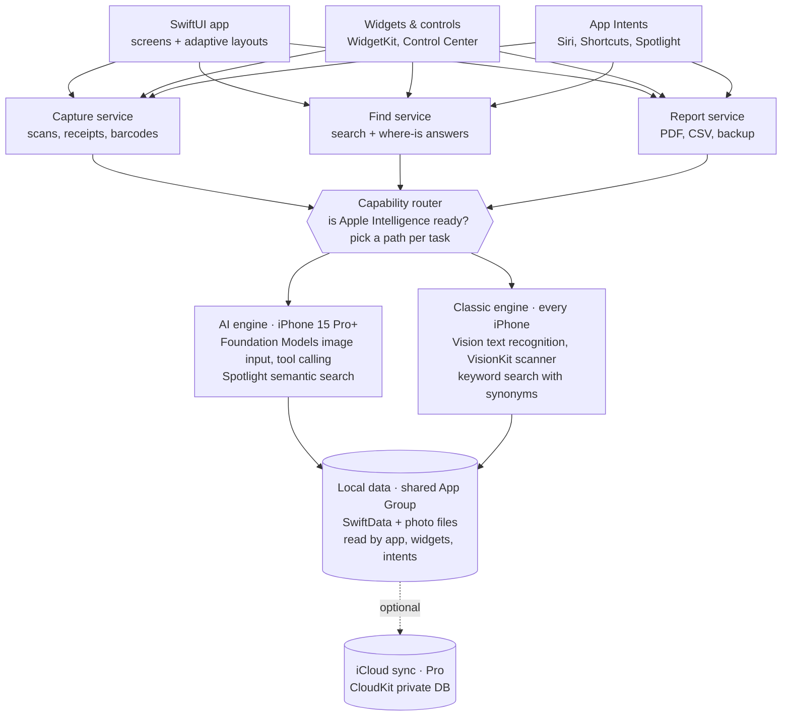

# Nook — PRD + Technical Spec

> **Canonical repo copy.** Converted from the Claude Doc *"Home Inventory & Warranty Vault — PRD + Technical Spec"* (2026-09-27, Pranav Shirole): https://claude.ai/code/artifact/8030b940-5e60-4e8d-a2a4-cf743d9c07ac
> From now on, this file is the source of truth. Change scope here, in a PR, and log the change in [decisions.md](decisions.md).
> Stable IDs (`F1`–`F11`, `US1`–`US6`, `J1`–`J8`) are referenced by every other doc. Don't renumber them.

---

## 1. Overview

**Nook** (working name) is a carefully designed iPhone and iPad app that knows everything you own and where it is. Photograph a room and the app lists the items in it. It reads receipts and serial numbers, remembers where each thing is kept, and produces an insurance-ready report in one tap. The whole app works fully on any iPhone that runs iOS 27 and any iPad that runs iPadOS 27 (D29). AI makes it faster, but AI is never required.

**Positioning:** "Everything you own, and exactly where it is. Pay once." Insurance is why people buy it. Finding things and knowing what you own is why they open it every week.

### Product principles, in priority order
1. **Design and UX come first.** Every screen should feel like a first-party Apple app, only warmer. If a feature can't be made delightful, it waits.
2. **Nothing requires AI.** Every AI action has a manual path that is fast and pleasant.
3. **Private by default.** All data and all AI processing stay on the device. There's no account, no server and no tracking.
4. **Fast to value.** A new user documents their first room in under 3 minutes.
5. **Pay once.** No subscriptions and no ads.

### Goals and success metrics (first 6 months after launch)
| Metric | Target |
|---|---|
| Net revenue | $1,000/month by month 6 (~59 Pro unlocks at $19.99, after the 15% commission) |
| Download → Pro conversion | 3–5% |
| Time to first room documented | Under 3 minutes (median) |
| Day-7 retention | 25% or more (driven by "Where is…?" lookups) |
| App Store rating | 4.7 or higher |
| Crash-free sessions | 99.8% or higher |

**Non-goals for v1:**
- Mac or Watch apps
- iPad-only behaviors beyond pointer and keyboard support: drag and drop, and multiple windows (v1.2, D29)
- Sharing with a household or other users
- A web dashboard
- Live price lookups for items
- Filing insurance claims directly
- Anything that needs a server

---

## 2. Users and use cases

The app is much more than an insurance tool. Insurance is a once-a-year need, while knowing what you own and where it is matters every week. The app is built around eight everyday jobs, and insurance is one of them.

### Personas
- **Maya, 34, homeowner.** Wants proof of her belongings in case of fire or theft, and keeps losing warranty receipts.
- **Jordan, 27, renter who moves often.** Wants to know what's in each box and what's still in storage.
- **Priya, 41, parent of three.** Needs to find the spare charger, the passports and the winter clothes bin fast.
- **Sam, 58, collector.** Tracks cameras, watches or vinyl, with serial numbers, purchase prices and condition.

### Everyday jobs the app does
| ID | Job | What the user says | Feature that answers it |
|---|---|---|---|
| J1 | Find things | "Where did I put the passports?" | Location memory and search (§6, F5) |
| J2 | Know what you own | "Do I already have an HDMI cable?" | Browse by room, category or tag |
| J3 | Protect value | "What would I claim if the house flooded?" | Insurance report with totals and photos (F9) |
| J4 | Track warranties | "Is the dishwasher still covered?" | Warranty dates and reminders (F4) |
| J5 | Move house | "What's in box 14?" | Boxes as locations, with printable QR labels (F8) |
| J6 | Lend and borrow | "Who has my drill?" | Mark an item as lent, with a person and return date (F7) |
| J7 | Declutter and sell | "What haven't I used in two years?" | Filter by last-seen date; export a list for resale |
| J8 | Estate and family | "What should my kids know about?" | Notes and a shareable PDF list |

### Top user stories for v1
- **US1** As a new user, I can document a room by taking photos, so I don't have to type every item.
- **US2** As a user on an older iPhone, I can add items quickly by hand, with photo, barcode and receipt scanning.
- **US3** As any user, I can ask or search "Where is my…?" and see the exact room and spot.
- **US4** As a user moving things around, I can update an item's location in 2 taps.
- **US5** As a homeowner, I can export a PDF of all items with photos, values and serial numbers.
- **US6** As a user, I'm reminded 30 days before a warranty ends.

---

## 3. Design and UX principles

The app should feel calm, tactile and personal, like a well-organized home rather than a spreadsheet. Design quality is the main way we beat competitors that already do inventory, so design gets the most time in every milestone.

### Design pillars
1. **Photos are the interface.** Items appear as large photo cards, not rows of text. A room screen looks like a well-lit shelf.
2. **One obvious action per screen.** Capture is always one tap away, through a floating Liquid Glass button.
3. **Native, not generic.** Use system components with the iOS 27 Liquid Glass look (tab bar, toolbars, sheets). Custom styling is limited to cards, colors and illustrations. iOS 27 has no opt-out from Liquid Glass, so we design for it rather than fight it.
4. **Kind to mistakes.** Every AI result is a suggestion the user can edit or undo. Deletes can be undone for 30 days (Recently Deleted).
5. **Quiet by default.** No badges, streaks or nagging. The only notifications are for warranties and returns the user asked about.

### Visual system
| Element | Specification |
|---|---|
| Typography | SF Pro with Dynamic Type everywhere; SF Pro Rounded for large headings and totals |
| Color | Warm neutral backgrounds; one accent color the user can pick (6 options); full light, dark and tinted-icon support |
| Room colors | Each room gets a soft color and SF Symbol, used on cards, widgets and the map of the home |
| Corners and spacing | Concentric corner radii that follow the device's screen corners; 8-pt spacing grid |
| Icons | SF Symbols 7 only, with variable colors and symbol effects |
| App icon | Light, dark, clear and tinted variants built in Icon Composer |

### Motion and haptics
- Zoom transitions from a photo card into the item's detail page.
- When the AI finds items in a photo, each detected item gets a soft outline and a light haptic tap, one after another. Detection should feel alive rather than instant and cold.
- A success haptic when an item is saved, and a selection haptic on pickers.
- All motion respects Reduce Motion, using cross-fades instead of zooms.

### Navigation (tab bar)
- **Home:** rooms as cards, total value, recently added, warranties ending soon.
- **Find:** one search field that also answers questions ("Where are the passports?"), plus filters.
- **Capture (floating button):** Scan room, Add item, Scan receipt, Scan barcode.
- **Reports:** insurance report, exports, warranty list.
- **Settings:** Pro, backup, Face ID lock, appearance.

### Onboarding (under 60 seconds)
1. One welcome screen with the promise: "Know what you own and where it is."
2. The user picks their rooms from suggested chips (Kitchen, Living room, Bedroom, Garage…) or adds their own.
3. Camera permission is requested only when the user first taps Scan, with a one-line reason.
4. The first scan is guided by a live coach overlay ("Step back a little so the whole shelf fits").

**Empty, loading and error states are designed screens, not afterthoughts.** Each has an illustration, one sentence and one action. For example, an empty room says "Nothing here yet. Scan this room to fill it in 30 seconds."

### Accessibility (release requirement, not a nice-to-have)
- VoiceOver labels for every card, including the item name, room and value.
- Dynamic Type up to the largest accessibility sizes, with layouts that switch from grids to lists.
- Minimum 44 × 44 pt tap targets and 4.5:1 text contrast.
- Every action is available without the camera, and without the AI.
- The App Store Accessibility Nutrition Label is filled in honestly.

---

## 4. Device and screen support

The app supports every iPhone that runs iOS 27, from the 4.7-inch iPhone SE to the iPhone Duo's 7.6-inch inner screen, and every iPad that runs iPadOS 27, from iPad mini to the 13-inch iPad Pro (D29). One adaptive layout, driven by size classes, covers them all. We never branch on device model, screen size or orientation. Apple's own iPhone Duo guidance says the same: avoid assumptions based on idiom and use size classes instead ([Apple Tech Talk](https://developer.apple.com/videos/play/tech-talks/111461/)).

### Screens we design and test for
| Device | Screen | Pixels | Layout class | Notes |
|---|---|---|---|---|
| iPhone Duo, inner | 7.6-inch folding OLED | 1878 × 2670 at 430 ppi | Regular width, regular height | Nearly square (~1:1.42). Hinge, under-display camera, no orientation lock |
| iPhone Duo, outer | 5.4-inch OLED | 1398 × 2034 at 460 ppi | Compact width (like other iPhones) | Wider and much shorter than any other iPhone; bars can lay out vertically beside the camera |
| iPhone 18 Pro Max | 6.9-inch | 2868 × 1320 at 460 ppi | Compact width | Largest slab phone; regular width in landscape |
| iPhone 18 Pro | 6.3-inch | 2622 × 1206 at 460 ppi | Compact width | Same size class as iPhone 17 |
| iPhone Air, 17, 17e, 16 | 6.1 to 6.6-inch | Various | Compact width | Standard tall 19.5:9 screens |
| iPhone SE (2nd/3rd gen), iPhone 11 | 4.7 and 6.1-inch | Various | Compact width | Oldest supported; no Apple Intelligence; SE has Touch ID and no Dynamic Island |
| iPad Pro / iPad Air, 13-inch | 13-inch | ~1032 × 1376 pt | Regular width, regular height | Widest layout; sidebar, grid and item detail can all show at once in landscape |
| iPad Pro / iPad Air / iPad, 11-inch | 11-inch | ~820–834 × 1180–1210 pt | Regular width, regular height | Mainline iPad |
| iPad mini | 8.3-inch | ~744 × 1133 pt | Regular width, regular height | Smallest iPad; checks that regular-width layouts don't assume a big screen |
| Any iPad, resized window | Any | Any size the user drags it to | Compact or regular width | Narrow windows get the iPhone layout |

iPad point sizes are from Apple's specs and are confirmed in the simulator in P1. As with Duo, layouts never use them as fixed values.

Apple has not published point dimensions for iPhone Duo. Third-party estimates differ, so the layout never uses fixed point values ([CodeConfig](https://codeconfig.dev/blog/iphone-duo-screen-size)).

### Layout rules
1. **Compact width** (all slab iPhones, Duo outer): tab bar at the bottom; single column; photo grid of 2 columns (3 on Pro Max in landscape).
2. **Regular width** (Duo inner, Pro Max landscape, iPhone Mirroring when enlarged):
   - The tab bar becomes a sidebar (`.defaultTabBarPlacement(.sidebar)`).
   - A two-column `NavigationSplitView` shows the room list beside the item grid.
   - Item details open beside the grid rather than covering it.
   - The photo grid grows to 4–5 columns.
3. **Duo half-folded ("tent" or "book"):** the capture screen puts the live camera on the top half and detected items on the bottom half. The item detail puts the photo above the fold and details below. Uses `ReservedRegion` (iOS 27.1) so nothing sits on the hinge.
4. **Duo outer screen:** the short height is treated as a first-class layout. Home shows a compact "Quick find" bar and 2 rows of cards, and nothing important sits below the fold.
5. **Opening or closing the Duo keeps context.** If you're viewing the kitchen on the outer screen and open the phone, you land on the same room and scroll position, now with the sidebar.
6. **Safe areas are asymmetric on Duo.** Handle each edge's inset separately, because vertical bars can appear on the left or right.
7. **Corners:** use `ConcentricRectangle` so cards follow each screen's corner shape, including Duo's.
8. **No `UIScreen.main`:** it's ambiguous on a two-display device. Read size and scale from the environment or window scene.
9. **Split View:** the app must work at any width Split View gives it on the Duo inner screen, down to compact width.
10. **iPad uses the regular-width layout.** It's the same layout as rule 2, with a few rules for very wide windows (D29):
    - Photo grids add columns as the width grows, up to 6.
    - Text-heavy content (item detail fields, editors, settings, reports) is capped at a readable width instead of stretching.
    - Editors, pickers and the paywall open as centered form sheets. The Capture menu opens as a popover from the Capture button.
11. **iPad windows resize freely** (Split View, Stage Manager and windowed apps). The app works at every size, and a narrow window gets the compact layout. v1.0 shows **one window at a time**; multiple windows come in v1.2 (D29).
12. **Pointer and keyboard (iPad, v1.0):**
    - Every tappable card and row shows a pointer hover effect.
    - Long-press menus also open with a secondary click.
    - The main commands have keyboard shortcuts, which also appear in the iPad menu bar (D29).

**Design deliverables per screen:** frames on the Claude Design canvas (D22) for 4.7-inch SE, 6.3-inch, 6.9-inch, Duo outer, Duo inner (open), Duo half-folded, and the largest accessibility text size. For iPad (D29): the 13-inch iPad in landscape and portrait, and iPad mini in portrait, for the screens that change at wide widths.

**Test matrix:** see [05_Testing_and_QA.md](05_Testing_and_QA.md). It covers:
- The iPhone SE simulator
- The iPhone 18 Pro and Pro Max simulators
- iPhone Duo in Xcode 27.1 Device Hub (open, closed, rotated, folded, Split View on both sides)
- The 13-inch iPad and iPad mini simulators, in portrait, landscape and a narrow resized window
- One real Apple Intelligence iPhone and one real older iPhone

---

## 5. Feature requirements

Every feature works on every supported iPhone and iPad. On iPhone 15 Pro and newer (and Apple Intelligence iPads) with Apple Intelligence on, the AI path does the typing for you. On older iPhones, or when Apple Intelligence is off, the manual path uses Apple's older on-device tools (Vision text recognition, barcode scanning, Spotlight search), which need no AI. The user never sees an error. They just see a slightly different, still polished flow.

| Feature | AI path (Apple Intelligence iPhones) | Manual path (every iPhone) |
|---|---|---|
| Scan a room | Photo → the on-device model lists each item with name, category and condition; user reviews and taps Save | Photo → user taps each item in the photo to draw a box and type a name, with smart suggestions from a built-in list of 500 common household items |
| Add a single item | Photo → name, category, brand and estimated condition filled in | Photo + form; name field autocompletes from the common-items list and your past items |
| Read receipts | Receipt photo → store, date, price, warranty length extracted into fields | Vision text recognition highlights prices and dates on the receipt; user taps a number to drop it into a field |
| Serial and model numbers | Model finds and labels the serial number on a sticker photo | Vision text recognition shows all text on the sticker; user taps the right line |
| Barcodes | System barcode tool reads UPC/EAN | Same (VisionKit barcode scanner works on all iPhones) |
| "Where is…?" questions | Natural-language answers from your own data (§6) | Instant search across names, tags, rooms and spots, with typo tolerance |
| Value estimate | Model suggests a replacement value range, clearly labeled as an estimate | User enters purchase price; app suggests nothing |
| Insurance report | Optional one-paragraph summary per room | Same report without the summary paragraphs |
| Siri | Siri AI can answer "Where's my passport?" through App Intents | Shortcuts and classic Siri phrases through the same App Intents |

### Detailed requirements
- **F1. Rooms, spots and containers.** A home contains rooms, and a room contains spots ("Top shelf", "Under bed"). Spots can contain containers ("Blue bin", "Box 14"), which can nest one level. Users can reorder, rename, recolor and delete them. *Acceptance:* create a room with 3 spots in under 30 seconds.
- **F2. Items.** Fields: name, photos (up to 10), room and spot, category, tags, quantity, brand, model, serial number, purchase date, price, store, receipt, warranty end date, notes, lent-to and last-seen date. Only the name is required. *Acceptance:* an item with just a photo and a name saves in 2 taps.
- **F3. Room scan.** Take one or more photos of a room or shelf. Detected items appear as outlined boxes on the photo and as cards below it. Each card can be accepted, edited or removed. "Save all" saves the accepted ones into the current room and spot. *Acceptance:* a shelf with 8 clear items produces at least 6 correct suggestions on an Apple Intelligence iPhone, and the manual path saves 8 items in under 2 minutes.
- **F4. Receipts and warranties.** Attach a receipt photo or PDF from Files or the share sheet. The warranty end date is computed from the purchase date plus the warranty length. Reminders go out 30 days and 7 days before the end. *Acceptance:* the reminder fires on schedule on a device with no network.
- **F5. Find.** One search field with instant results as you type, filters (room, category, tag, value, warranty status, lent out) and saved searches. On AI iPhones the same field accepts questions (§6). *Acceptance:* results appear in under 100 ms for a 5,000-item home.
- **F6. Move items.** From an item, a "Move" button opens a picker of rooms and spots, with the last 5 used at the top. Multi-select moves many items at once. Every move is recorded in the item's location history. *Acceptance:* moving one item takes 2 taps.
- **F7. Lending.** Mark an item as lent to a contact (or a typed name), with an optional return date and reminder. *Acceptance:* lent items show a badge and appear in a "Lent out" filter.
- **F8. Box labels (moving house).** Print or share a QR label for any container. Scanning it with the iPhone camera opens that box's contents in the app. *Acceptance:* the QR code opens the correct container from the system Camera app.
- **F9. Insurance report and exports (Pro).**
  - A PDF report grouped by room, with photos, values, serial numbers, receipts attached as an appendix, and totals.
  - A CSV export of all fields.
  - A full backup as a single `.nookbackup` file (a zip of JSON and photos).

  *Acceptance:* a 500-item PDF generates on the device in under 20 seconds.
- **F10. Widgets and controls.** Home Screen widgets: "Warranties ending soon", "Total home value" and "Quick find". A Control Center control opens room scan. *Acceptance:* widgets render correctly on all screens, including Duo inner.
- **F11. Privacy lock.** Optional Face ID or Touch ID lock (Touch ID on iPhone Duo, SE and iPads with Touch ID). Values can be hidden with a tap for screen sharing.

---

## 6. Location memory: "Where is my…?"

This is a headline feature. It's the reason people will open the app every week, not just once a year for insurance. The memory does not live inside the AI. It lives in the app's own database as a location for every item, plus a history of every move. The AI only reads and writes that record. This keeps answers reliable: **the AI can't invent a location, because it can only report what's saved.**

### How it works for the user
1. **Every item has a home.** When you add an item, you place it in a room and optionally in a spot or container ("Bedroom → Wardrobe → Top shelf"), plus an optional photo of the spot.
2. **Ask anytime.** Type or say "Where are the passports?" The app answers with a card: "Office → Desk → Second drawer. You put them there on Aug 3." The card shows the item photo, the spot photo and a Move button.
3. **Tell it when you move something.** Type or say "I put the passports in the safe." On AI iPhones, the app understands this and shows a confirmation card ("Move Passports to Bedroom → Safe?"). One tap confirms. **Nothing moves without that tap.**
4. **Found it somewhere else?** From any answer card, "Found it here instead" opens the move picker, so the memory corrects itself.
5. **Lent or packed.** Lent items answer "Jordan has it since Sep 12". Packed items answer "Box 14, packed Jun 2".

### Example questions it answers
| Question | Answer comes from |
|---|---|
| "Where's the spare car key?" | Item location + last-moved date |
| "What's in the garage?" | All items in that room, grouped by spot |
| "What's in box 14?" | Container contents |
| "Where did the drill used to be?" | Location history |
| "What did I lend out?" | Lent-to field |
| "Do I have any AA batteries?" | Name and tag search, with quantity |

### AI path vs manual path
- **AI (Apple Intelligence iPhones):** the on-device model turns the question into a structured search (item, room, time, action) using Foundation Models tool calling. The app runs the search on its own database, and the model phrases the answer. Spotlight semantic search helps match loose wording ("car fob" finds "Spare car key").
- **Manual (every iPhone):** the same search field returns instant results for item names, tags, rooms and spots, with typo tolerance and synonyms from a built-in list ("fob" → "key"). The answer card looks identical. Moving is done with the Move button.
- **Siri and Shortcuts (both):** App Intents for "Find item", "Move item" and "What's in [room]" work with Siri AI on newer iPhones, and with Shortcuts and classic Siri everywhere.

### Honest limits, and how the design handles them
- **The memory is only as good as the last update.** Every answer shows when the location was last confirmed, so users know how fresh it is.
- **The app can't see physical objects.** Apple doesn't let third-party apps read AirTag or Find My locations. For valuables, the item page can link to the Find My app as a shortcut.
- **Updating must be effortless, or people stop doing it.** The Move action is available from the answer card, search results, widgets, Siri and a Lock Screen control.

**Privacy:** location data never leaves the phone, or the user's private iCloud if sync is on. Sensitive items (passports, jewelry, the safe) can be marked Private. Private items are hidden from Spotlight and Siri suggestions, and viewing them requires Face ID or Touch ID.

---

## 7. Monetization and paywall

Free download, then a one-time $19.99 "Nook Pro" unlock. No subscription and no ads. About 59 unlocks a month reach $1,000 net after Apple's 15% Small Business Program commission.

| | Free | Pro ($19.99 once) |
|---|---|---|
| Items | Up to 25 | Unlimited |
| Rooms | Unlimited | Unlimited |
| AI room scan, receipt reading | Yes (within the 25 items) | Yes |
| "Where is…?" and search | Yes | Yes |
| Warranty reminders | Up to 3 | Unlimited |
| Insurance PDF, CSV export | Preview only (watermarked first page) | Yes |
| iCloud sync and backup | No | Yes |
| Widgets, box QR labels, lending | Yes | Yes |

### Paywall design rules
- The paywall appears at a moment of value: adding the 26th item, or tapping Export on the insurance report. It never appears on launch.
- One screen, one price, one button. It shows the user's own numbers ("You've documented 25 items worth $4,380").
- A clear Restore Purchases button, and Family Sharing enabled for the unlock.
- Nothing the user has already entered is ever locked away. Free users can always view, search and delete everything.

**Technical:** a StoreKit 2 non-consumable in-app purchase, shown with the native `ProductView`. The entitlement is checked with `Transaction.currentEntitlements` and cached for offline use. No third-party SDKs.

**Launch pricing:** $14.99 introductory price for the first 2 weeks, then $19.99. Seasonal lifetime-style discounts (Black Friday, moving season in June) are allowed twice a year.

---

## 8. Technical architecture

Nook is a native Swift 6 and SwiftUI app with no server. All data and AI run on the iPhone, with optional iCloud sync for Pro users. One **capability router** decides, task by task, whether to use the on-device AI or the classic Vision tools, so the rest of the app never needs to care which iPhone it's on.



Services never call the AI directly. They ask the router, which returns the same result type from either engine, so screens look identical on every iPhone.

### Stack
| Layer | Choice | Why |
|---|---|---|
| Language and UI | Swift 6, SwiftUI, Observation | Best support for Liquid Glass, iPhone Duo layouts and Dynamic Type |
| Minimum OS | iOS 27.0 and iPadOS 27.0 (D29); v1.0 builds with the current release of Xcode 27, and v1.1 (iPhone Duo) with the iOS 27.1 SDK (D23) | Foundation Models image input is in the iOS 27 SDK; full-screen iPhone Duo support needs 27.1 |
| Storage | SwiftData in an App Group container | Shared with widgets and App Intents; simple migrations |
| Photos | HEIC files on disk, 400-px thumbnails cached | Keeps the database small and scrolling fast |
| AI | Foundation Models (on-device model), `@Generable` structured output, tool calling, OCR and barcode tools | Free, private, offline |
| Classic path | Vision `RecognizeTextRequest`, VisionKit `DataScannerViewController`, Core Spotlight | Works on every iOS 27 iPhone |
| Sync | SwiftData with CloudKit private database (Pro only) | No backend for us to run or pay for |
| Purchases | StoreKit 2 | Native, no third-party SDK |
| PDF | SwiftUI `ImageRenderer` into PDF pages | On-device, matches the app's design |
| Dependencies | None at launch | Fewer risks, smaller app |

### Data model
| Entity | Key fields | Relationships |
|---|---|---|
| Room | name, symbol, color, order | has many Spots and Items |
| Spot | name, photo, parent spot (for containers), QR id | belongs to a Room; has many Items |
| Item | name, category, tags, quantity, brand, model, serial, price, currency, purchase date, store, warranty end, notes, isPrivate, createdAt, lastConfirmedAt | belongs to a Spot or Room; has many Photos, Receipts, LocationEvents |
| Photo | file name, width, height, bounding box (if cropped from a room scan) | belongs to an Item or Spot |
| Receipt | file name, type (image or PDF), extracted text | belongs to an Item |
| LocationEvent | from spot, to spot, date, source (manual, Siri, AI) | belongs to an Item; powers location history |
| Loan | person name, contact id, date lent, due date, returned date | belongs to an Item |

(The CloudKit-safe implementation rules for this model are in [04_Architecture.md](04_Architecture.md).)

### Choosing the path on each iPhone (the router's first check)
```swift
import FoundationModels

// The two ways the app can do a task.
enum Engine {
    case ai       // On-device Apple Intelligence model is ready
    case classic  // Older iPhone, AI turned off, or model still downloading
}

func currentEngine() -> Engine {
    // Ask iOS if the on-device model can be used right now.
    switch SystemLanguageModel.default.availability {
    case .available:
        return .ai
    default:
        // Any other answer: quietly use the classic tools instead.
        return .classic
    }
}
```

### Room scan pipeline (AI path)
1. The photo is resized to 1,536 px on the long side to keep the model fast.
2. The model receives the image with instructions and returns a list of `DetectedItem` values. The output is structured, so no text parsing is needed.
3. The OCR and barcode tools are offered to the model so it can read labels it sees.
4. Results stream in as they're generated, so the first item card appears in about a second.
5. Any failure (model busy, guardrail, timeout after 20 s) switches that photo to the manual tagging screen with the photo already loaded.

```swift
import FoundationModels

// The shape the AI fills in for each item it spots in a photo.
@Generable
struct DetectedItem {
    @Guide(description: "Short everyday name, for example 'Coffee machine'")
    var name: String

    @Guide(description: "One of: Electronics, Furniture, Appliances, Clothing, Jewelry, Tools, Kitchen, Books, Sports, Other")
    var category: String

    var brand: String?   // Left empty when no brand is visible
}
```

- **App Intents and Siri:** `FindItemIntent`, `MoveItemIntent`, `ListRoomIntent`, `AddItemIntent` and `ScanRoomIntent`.
  - Items and rooms are exposed as `AppEntity` types and indexed in Spotlight, except items marked Private.
  - View annotations tell Siri AI which item is on screen.
- **Widgets and controls:** WidgetKit reads the shared App Group store directly, read-only. A Control Center control and an Action button option launch room scan.
- **iPhone Duo specifics:**
  - `NavigationSplitView` with sidebar tab placement
  - `ReservedRegion` around the hinge in the capture screen
  - `ConcentricRectangle` cards
  - Per-edge safe-area handling
  - No use of `UIScreen.main`
- **Project structure:** one app target, a widget extension, and three local Swift packages:
  - **NookKit** for models and storage
  - **NookAI** for the router and both engines
  - **NookUI** for the design system

  Keeping AI code in its own package makes it easy to test the classic path on its own.

---

## 9. Privacy, security, performance and testing

**Nothing about a user's home ever reaches us.** There are no accounts, no analytics SDKs, and no network calls except Apple's own StoreKit and optional iCloud sync. The App Store privacy label should read "Data Not Collected".

### Privacy and security
- All AI runs on-device. Private Cloud Compute and third-party models are not used in v1.
- Files use iOS Data Protection (`completeUntilFirstUserAuthentication`) so widgets still work after the first unlock.
- Optional app lock with Face ID or Touch ID. Private items always require it.
- Private items are excluded from Spotlight, Siri suggestions and widgets.
- Exports are generated locally and shared only through the system share sheet.
- An App Store privacy label, and a plain-language privacy page linked from Settings.

### Performance budgets
| Moment | Budget |
|---|---|
| Cold launch to Home | Under 400 ms on iPhone 15 |
| Scrolling a 1,000-item grid | 120 fps on ProMotion screens, no dropped frames |
| Search results as you type | Under 100 ms for 5,000 items |
| First AI item card after taking a photo | Under 2 s |
| Full room scan (one photo, ~10 items) | Under 8 s on an AI iPhone |
| 500-item insurance PDF | Under 20 s |
| App download size | Under 30 MB |

### Testing
- Unit tests for the data model, warranty dates, search ranking and the router's fallback logic.
- AI quality tests using Apple's Evaluations framework. A set of 100 labeled household photos tracks how many items are correctly named per photo, run on each iOS update.
- UI tests for the top 6 user stories, run on iPhone SE, iPhone 18 Pro Max, the 13-inch iPad and iPad mini (D29), and iPhone Duo (open, closed, half-folded) in Device Hub.
- The App Intents Testing framework for Siri and Shortcuts flows.
- An accessibility audit with Xcode's Accessibility Inspector and a manual VoiceOver pass before every release.
- A "No AI" test pass: the full app is tested with Apple Intelligence turned off, on every release.
- A TestFlight beta with at least 30 testers, including 10 on iPhones without Apple Intelligence and at least 5 on iPads.

---

## 10. Roadmap, risks and open questions

The plan is about 14 weeks, part-time, launching in early January 2027 to catch the New Year organizing season. Design gets 3 full weeks up front and a polish phase at the end. The phase-level breakdown is in [02_Development_Roadmap.md](02_Development_Roadmap.md).

```
Start Sep 28, 2026
 ├─ M1 Design ............ wk 1–3   Design frames for every screen and iPhone size; clickable prototype
 │   ◆ G1 Prototype passes a 5-person test
 ├─ M2 Core build ........ wk 4–7   Rooms, items, spots; manual scan and search; move, lend, warranties
 │   ◆ G2 Full app works with AI turned off
 ├─ M3 AI and iPhone Duo . wk 8–10  AI room scan, receipts; where-is answers; Duo layouts, widgets
 │   ◆ G3 AI names 6 of 8 test-shelf items
 └─ M4 Polish and beta ... wk 11–13 Motion, haptics, a11y; TestFlight (30 testers); paywall and listing
     ◆ G4 Launch Jan 2027 · 99.8% crash-free
```

Each gate must pass before the next phase starts. The "works with AI off" gate protects everyone on older iPhones.

### After launch (v1.1 to v2)
- **v1.1:** household sharing through iCloud shared zones, and more languages (German, Spanish, French, Japanese first).
- **v1.2:** iPad-only behaviors: drag and drop (items onto rooms, photos and receipts from Files) and multiple windows (D29). The iPad layout, pointer and keyboard support ship in v1.0.
- **v2:** optional Private Cloud Compute for long insurance write-ups, an Apple Watch "Where is…?" glance, and a Mac app for bulk editing.

### Risks
| Risk | Likelihood | Mitigation |
|---|---|---|
| AI misnames items or misses some | High | Every result is editable; manual tagging is one tap away; quality tracked with 100 test photos |
| Users stop updating locations | Medium | Move from anywhere (Siri, widget, Lock Screen control); "last confirmed" date on every answer |
| iPhone Duo layouts break in rare poses | Medium | Size-class-only layouts; Device Hub test matrix on every build |
| Apple changes Foundation Models behavior in an update | Medium | Router falls back to classic path; evaluations rerun on each iOS beta |
| Apple adds a similar built-in feature | Low | Differentiate on design, location memory and the insurance report |
| Too few downloads to reach $1,000/month | Medium | App Store keyword work before building; localization in v1.1; seasonal promotions |

### Open questions
- [ ] Final app name: "Nook" is a placeholder; check App Store and trademark availability.
- [ ] Confirm the oldest iPhone that iOS 27 supports, to finalize the smallest test device.
- [ ] Confirm official iPhone Duo point sizes once Apple documents them.
- [ ] Confirm the oldest iPad that iPadOS 27 supports, and which iPads have Apple Intelligence (D29).
- [ ] Pick the launch countries and currencies for the value fields.

### Sources
- [iPhone Duo technical specifications, Apple](https://www.apple.com/iphone-duo/specs/)
- [Prepare your app for iPhone Duo, Apple Developer Tech Talk](https://developer.apple.com/videos/play/tech-talks/111461/)
- [iPhone 18 Pro technical specifications, Apple](https://www.apple.com/iphone-18-pro/specs/)
- [iPhone Duo screen size, CodeConfig](https://codeconfig.dev/blog/iphone-duo-screen-size)
