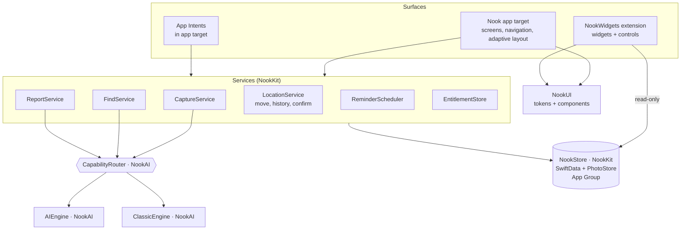

# Nook — Architecture & Engineering Conventions

How the app is built, and the constraints that exist **no matter which screen you're working on**. Product scope is in [00_PRD.md](00_PRD.md) §8. This doc turns that into rules and contracts.

- **Stack:** Swift 6 (strict concurrency) · SwiftUI + Observation · SwiftData in an App Group · Foundation Models · Vision / VisionKit · Core Spotlight · UserNotifications · WidgetKit · App Intents · StoreKit 2 · CloudKit (Pro).
- **Platform:** iOS 27.0 minimum (D1). v1.0 builds with the current release of Xcode 27; the iOS 27.1 SDK is needed only for P14 (D23).
- **Dependencies:** zero third-party runtime dependencies. Build-time lint and format tools are allowed.

---

## 1. Layers



**Dependency direction (enforced by the package manifests):**
- `NookUI` → none
- `NookKit` → none
- `NookAI` → `NookKit` (for the model types and repository protocols)
- The app and `NookWidgets` → all three

- Screens never import `FoundationModels` or `Vision`. Only `NookAI` does.
- Widgets never write to the store.

---

## 2. The capability router (the central contract)

**Rule:** services ask the router. They never call an engine or Foundation Models directly. Both engines return **the same result types**, so screens can't tell which engine ran (PRD §8).

```swift
// NookAI/Sources/NookAI/Router/CapabilityRouter.swift
import FoundationModels

public enum Engine: Sendable { case ai, classic }

/// One task the app can ask for. Each has an AI and a classic implementation.
public protocol CapabilityEngine: Sendable {
    func detectItems(in photo: PhotoInput) -> AsyncThrowingStream<DetectedItem, Error>   // F3
    func fillItem(from photo: PhotoInput) async throws -> ItemSuggestion                 // single add
    func readReceipt(_ doc: DocumentInput) async throws -> ReceiptReading                // F4
    func readSerial(from photo: PhotoInput) async throws -> SerialReading                // F2
    func answer(_ query: String, store: any FindQuerying) async throws -> FindAnswer     // §6
}

public actor CapabilityRouter {
    private let ai: any CapabilityEngine
    private let classic: any CapabilityEngine
    private let availability: @Sendable () -> Engine    // injectable for tests
    private var forceClassic = false                     // debug toggle + "No AI" test pass

    public init(ai: any CapabilityEngine, classic: any CapabilityEngine,
                availability: @escaping @Sendable () -> Engine = CapabilityRouter.systemAvailability) {
        self.ai = ai; self.classic = classic; self.availability = availability
    }

    public static let systemAvailability: @Sendable () -> Engine = {
        switch SystemLanguageModel.default.availability {
        case .available: .ai
        default: .classic          // not eligible, AI off, model downloading, etc.
        }
    }

    /// Checked per task, not once at launch — availability can change mid-session.
    public func engine() -> any CapabilityEngine {
        (!forceClassic && availability() == .ai) ? ai : classic
    }
}
```

**Router rules:**
1. **Check per task.** Availability can change while the app is running (the user turns AI off, or the model finishes downloading).
2. **Timeouts:** an AI room scan has a 20 s timeout per photo. On timeout, a guardrail refusal, a busy model or any thrown error, **fall back per photo** to the manual flow with the photo already loaded. Never show an error that mentions AI.
3. **Streaming:** `detectItems` streams results, so the first card should appear in under 2 s.
4. **Answers come from records.** `answer(_:)` on the AI engine uses **tool calling** into `FindQuerying` (NookKit). The model builds the query and phrases the result. It **never invents a location**. With no record, it returns `.notFound`.
5. **Moves always return a proposal.** AI engines never write. `FindAnswer.proposedMove` is shown in the confirm card, and only `LocationService.move(...)` writes, after the user taps.
6. **Image preparation:** before model input, resize to 1,536 px on the long side (PRD pipeline).
7. **Tests:** every engine method has a test against a fake availability, for `.ai`, `.classic`, and AI throwing or timing out.

The shared result types live in NookAI: `DetectedItem` (`@Generable`, see PRD §8), `ItemSuggestion`, `ReceiptReading` (fields with a confidence level), `SerialReading`, `FindAnswer` (items, breadcrumb, lastConfirmed, proposedMove?). AI-only extras (the value estimate, the room summary) are **optional fields**, and the classic engine leaves them `nil`.

---

## 3. Project layout

```
Nook.xcodeproj
Nook/                         # app target
  App/                        # NookApp, RootView, deep links, scene/restoration
  Features/
    Home/  Room/  Item/  Capture/  Find/  Reports/  Settings/  Onboarding/  Paywall/
  Intents/                    # App Intents, AppEntities, App Shortcuts
  Resources/                  # Assets (app icon), Localizable.xcstrings, common-items.json, synonyms.json
NookWidgets/                  # widget + control extension
Packages/
  NookKit/    Sources/NookKit/{Models, Store, Services, Search, Reminders, Backup, Entitlements}
  NookAI/     Sources/NookAI/{Router, AIEngine, ClassicEngine, Types, Evaluations}
  NookUI/     Sources/NookUI/{Tokens, Components, Gallery}   # Assets.xcassets with color sets
NookTests/  NookUITests/
Fixtures/                     # receipts, test-shelf photos, seed JSON, golden PDFs/CSVs
docs/
```

Each feature folder contains `<Feature>Screen.swift`, the subviews, and a `@Observable` `<Feature>Model` when state is non-trivial. There is **no** MVVM boilerplate beyond that: small views can read services from the environment directly.

---

## 4. Data model (NookKit)

The entities come from PRD §8, plus `Warranty` (D21).

| Model | Fields (all optional or defaulted) | Relationships (all optional, with inverses) |
|---|---|---|
| `Room` | id: UUID, name, symbol, colorKey, order, createdAt | spots [Spot], items [Item] (items placed directly in the room) |
| `Spot` | id, name, qrID: String, packedAt?, order, createdAt | room: Room?, parent: Spot?, children [Spot], items [Item], photo: Photo? |
| `Item` | id, name, category, tags [String], quantity = 1, brand, model, serial, barcode, price: Decimal?, currencyCode, purchaseDate, store, notes, isPrivate = false, valueEstimateLow/High?, createdAt, lastConfirmedAt, lastSeenAt, deletedAt? | room: Room?, spot: Spot?, photos [Photo], receipts [Receipt], warranties [Warranty], events [LocationEvent], loans [Loan] |
| `Photo` | id, fileName, width, height, boxX/Y/W/H? (normalized, from a scan), order | item: Item?, spot: Spot? |
| `Receipt` | id, fileName, kind (image or pdf), extractedText | item: Item? |
| `Warranty` | id, kind (manufacturer, extended or store), provider, startDate, endDate, lengthMonths?, policyNumber, cost?, reminderOffsetsDays = [30, 7], snoozedUntil? | item: Item? |
| `LocationEvent` | id, fromPath: String, toPath: String, fromSpotID?, toSpotID?, date, source (manual, siri, ai, qr) | item: Item? |
| `Loan` | id, personName, contactID?, lentAt, dueAt?, returnedAt?, remind = true | item: Item? |

### CloudKit-safe rules (from P2 onward, D8)
SwiftData + CloudKit fails at runtime unless all of these hold:
- **Every attribute is optional or has a default value.**
- **Every relationship is optional and has an explicit inverse.** No `.deny` delete rule. Use `.cascade` for owned children (photos, receipts, warranties, events, loans) and `.nullify` otherwise.
- **No `@Attribute(.unique)`.** Identity is an **app-owned `id: UUID`**, and duplicates created by sync are merged in `DedupeService` by `id`.
- **No ordered relationships.** Order is stored in an `order: Int` field.
- Enums are stored as raw `String` values with a computed accessor.
- Photo and PDF blobs **never** go in the database. Store the file name only (see §5).

```swift
@Model
final class Item {
    var id: UUID = UUID()
    var name: String = ""
    var quantity: Int = 1
    var isPrivate: Bool = false
    var lastConfirmedAt: Date = Date.now
    var deletedAt: Date? = nil                       // Recently Deleted (D14)
    var sourceRaw: String = "manual"

    @Relationship(deleteRule: .nullify, inverse: \Spot.items) var spot: Spot?
    @Relationship(deleteRule: .cascade, inverse: \Photo.item) var photos: [Photo]? = []
    @Relationship(deleteRule: .cascade, inverse: \LocationEvent.item) var events: [LocationEvent]? = []
    // …
    init() {}
}
```

- **Schema versioning:** `NookSchemaV1: VersionedSchema` plus `NookMigrationPlan`. Every model change uses the `data-model-change` skill and adds a new schema version and a migration test.
- **Container:** the store sits in the App Group container, `ModelConfiguration(groupContainer: .identifier(...))`. CloudKit is set to `.none` for Free users and `.private(...)` for Pro (P11).
- **Soft delete:** `deletedAt` is set on delete, and queries filter out deleted rows. Rows older than 30 days are purged on launch.
- **Location invariant:** an item has a `room` and, optionally, a `spot`. If `spot` is set, `room == spot.room` (or `spot.parent.room`). **All location writes go through `LocationService.move(items:to:source:)`.** It updates both fields, appends a `LocationEvent`, sets `lastConfirmedAt`, updates Spotlight, and posts a widget reload.
- **Container depth:** `Spot.parent.parent` must be nil (containers nest one level, D3). The service layer enforces this.
- **Free limit:** `EntitlementStore.canAddItems(count:)` counts non-deleted items. It is checked in services, not views.

---

## 5. Storage & files

- **Photos:** HEIC files in `AppGroup/Photos/<uuid>.heic`, with 400-px thumbnails in `AppGroup/Thumbs/`. Loading downsamples (ImageIO) into an in-memory `NSCache`.
- **Receipts:** stored in `AppGroup/Receipts/<uuid>.(heic|pdf)`.
- **iCloud sync (Pro)** syncs files as `CKAsset`s through a small sync companion [design in P11]. Alternatively, files move to external storage attributes if CloudKit sync of `@Attribute(.externalStorage)` proves reliable. The choice is made in P11 and logged in decisions.md.
- **Data Protection:** `completeUntilFirstUserAuthentication` on the store and files, so widgets work after the first unlock (PRD §9).
- **Backup (`.nookbackup`, D12):** a zip containing `manifest.json` (with `schemaVersion`, `appVersion` and `createdAt`), `data.json` (all entities keyed by UUID) and `files/`. Restore offers **Replace** or **Merge**, where Merge upserts by UUID.
- **No network calls** except StoreKit and CloudKit. The CI grep fails on `URLSession` usage outside an allowlist.

---

## 6. Find (search) design

**Budget:** under 100 ms per keystroke at 5,000 items (F5).
- Each item has a precomputed `searchText` field: its name, tags, brand, model, serial, room name, spot path and receipt text, all lowercased and stripped of diacritics.
- The `SearchIndex` actor in NookKit keeps an in-memory token index, built at launch in the background and updated incrementally on save. It matches on:
  - prefix
  - typo tolerance: Damerau-Levenshtein ≤ 1 for tokens of 4 characters or more, ≤ 2 for 8 or more
  - the synonym expansion list from `synonyms.json` ("fob" → "key")
- **Ranking:** exact name > name prefix > tag > synonym > room/spot > receipt text. Boost recently confirmed items.
- **Answers:** `FindQuerying` exposes `items(matching:)`, `contents(of:)`, `history(of:)` and `loans()`. The AI engine calls these as Foundation Models tools. The classic engine calls them directly.
- **Spotlight:** Core Spotlight indexes items, rooms and spots, **excluding `isPrivate`**. Changes are pushed from `LocationService` and `ItemService`.

---

## 7. Reminders (warranties + loans)

The system caps pending notification requests at **64 per app**, with no workaround. So the scheduler is a pure function plus a reconciler (D13):

```swift
/// Pure: what *should* be pending, soonest first, capped.
func desiredReminders(warranties: [WarrantySnapshot], loans: [LoanSnapshot],
                      now: Date, calendar: Calendar, cap: Int = 60) -> [ReminderRequest]
```

- The reconciler diffs `desiredReminders` against `UNUserNotificationCenter.pendingNotificationRequests`, removing and adding only what changed. It runs on launch, on any warranty or loan change, and on background refresh (`BGAppRefreshTask`).
- Each fire date is `endDate − offsetDays` at the user's chosen time of day, **in the current time zone** (`Calendar.current`). Past dates are skipped.
- The Free tier limits active reminders to 3 (D9). Enforcement lives in `EntitlementStore`, not in the scheduler.
- Categories: `WARRANTY` (View, Snooze 1 week) and `LOAN` (Mark returned, Snooze).
- Tests inject `now`, the `calendar` and a fake notification center.

---

## 8. App surfaces

- **Deep links (D19):**
  - `nook://item/<uuid>`, `nook://room/<uuid>`, `nook://spot/<qrID>`, `nook://find?q=…`, `nook://scan`
  - One `DeepLinkRouter` in the app builds the navigation path, so the back stack is intact.
  - Private targets require authentication.
- **App Intents:**
  - `FindItemIntent`, `MoveItemIntent`, `ListRoomIntent`, `AddItemIntent`, `ScanRoomIntent`.
  - `ItemEntity` and `RoomEntity` use `EntityQuery` backed by `FindQuerying`.
  - App Shortcuts phrases are included.
  - `MoveItemIntent` asks for confirmation (`requestConfirmation`) before writing.
  - Private items are excluded from entity queries unless the app is unlocked.
- **Widgets:**
  - A read-only `ModelContainer` on the same App Group store.
  - The Total value widget honors Hide values, and every widget excludes Private items.
  - Reloads are triggered with `WidgetCenter.shared.reloadAllTimelines()` from services after writes.
- **Controls:** a Control Center control and an Action button option for room scan (`ScanRoomIntent`), and a Lock Screen control for Move.

---

## 9. Adaptive layout rules (PRD §4)

- **Size classes only.** Use `@Environment(\.horizontalSizeClass)` and `ViewThatFits`, with geometry from the container. **Never** `UIScreen.main`, and never branch on device model or idiom. CI greps for `UIScreen.main` and `userInterfaceIdiom`.
- **Regular width** uses `NavigationSplitView` with the sidebar tab placement. On iPad it's the same view; the system decides how many columns fit the window (D29).
- **iPad (D29):**
  - One target, universal (iPhone + iPad), iPadOS 27.0 minimum.
  - **One window in v1.0** (verified in D30): set `INFOPLIST_KEY_UIApplicationSceneManifest_Generation = NO` and give the Info.plist a `UIApplicationSceneManifest` with `UIApplicationSupportsMultipleScenes` = `NO`. The template's generated manifest turns multiple windows **on**. A test checks `UIApplication.shared.supportsMultipleScenes == false`. Multiple windows are v1.2.
  - **Keyboard shortcuts:** `.keyboardShortcut` on the commands in 01 §1.5, grouped in a `CommandMenu` inside `.commands`, so they appear in the iPad menu bar (verified in D30). The system adds File, Edit (Undo, Redo, Cut, Copy, Paste), View, Window and Help itself. Replace `.appSettings` so ⌘, opens Nook's Settings tab instead of the iPad Settings app. Don't use ⌘M, which is reserved for minimizing (D30).
  - **Pointer:** `.hoverEffect` on custom cards and rows; system controls get it for free. Secondary click comes from `.contextMenu`.
  - **Undo:** moves, deletes and saves register with the window's `UndoManager`, so ⌘Z and the shake gesture behave the same as the Undo toast.
- **Duo hinge:** use `ReservedRegion` [Verify in SDK] on the capture and item-detail screens.
- **Safe areas:** read each edge separately.
- **State restoration:** use `@SceneStorage` for the tab, the navigation path (Codable IDs) and scroll anchors, so fold/unfold and relaunch keep context.

---

## 10. Concurrency, errors, logging

- **Swift 6 strict concurrency.** Services are `actor`s or `@MainActor` `@Observable` classes. SwiftData `ModelContext` is used on the main actor for UI, and through a `@ModelActor` for background work (import, backup, index build, PDF data gathering).
- **Errors:** each service defines a small `enum` error type. Screens map errors to designed error states with plain copy (03 §8.9). Never show `localizedDescription` from system errors directly.
- **Logging:** use `Logger(subsystem: "<bundle>", category: "<package>.<area>")`. **Never log user content** (item names, locations, receipt text): use `privacy: .private` for anything user-derived. There are no analytics SDKs.
- **Feature flags:** `FeatureFlags` is a compile-time and debug-menu enum for work in progress across phases. Remove each flag when its phase ships.

---

## 11. Code conventions

- **Naming:** types use `UpperCamelCase`, screens are `<Name>Screen`, observable state is `<Name>Model`, and services are `<Name>Service`.
- **One primary type per file.** Keep files under about 400 lines.
- **Previews:** every screen has `#Preview`s for each state (empty, loaded, error, and AX5), plus dark mode. Previews use `PreviewStore.seeded(.small)`.
- **Tokens only** for color, type, spacing, radius, motion and haptics (03). Copy lives in `Localizable.xcstrings` from day one, in English only for v1.
- **Accessibility is part of "done":** labels, custom actions, and Dynamic Type through AX5.
- **Tests:** Swift Testing (`@Test`) for units, XCUITest for flows (see [05](05_Testing_and_QA.md)).
- **Comments** explain *why*. Link to PRD or decision IDs where a rule comes from, for example `// D13: 64-request cap`.
- **Unverified APIs:** any API marked `[Verify in SDK]` must be confirmed in the SDK you build with (D23) before it's used. Record the result in decisions.md (D11).

---

## 12. Performance budgets (PRD §9; enforced in P13, watched every phase)

| Moment | Budget | How to measure |
|---|---|---|
| Cold launch to Home | < 400 ms (iPhone 15) | Instruments App Launch; `XCTApplicationLaunchMetric` |
| 1,000-item grid scroll | 120 fps, no drops | Instruments Hitches; `XCTOSSignpostMetric.scrollingAndDecelerationMetric` |
| Search keystroke | < 100 ms @ 5k | `measure {}` on `SearchIndex` with the 5k fixture |
| First AI card | < 2 s | signpost from shutter to first stream element |
| Room scan (~10 items) | < 8 s | signpost around `detectItems` |
| 500-item PDF | < 20 s | `measure {}` on `ReportService` with fixture |
| Download size | < 30 MB | App Store Connect / `xcodebuild -exportArchive` thinning report |
